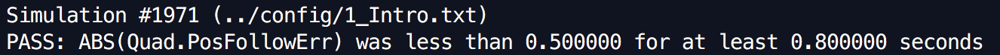
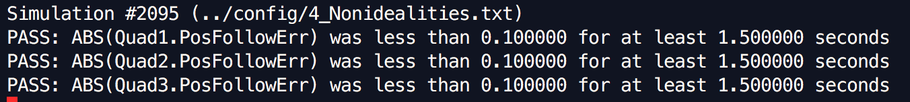

# The C++ Project Readme #

This is the readme for the C++ project.

For easy navigation throughout this document, here is an outline:

 - [Intro Senaorio](#intro-senaorio)
 - [Body Rate Control & Roll Pitch Control & Thrust Calculation](#body-rate-control-&-roll-pitch-control-&-thrust-calculation)
 - [Attitude Control & Lateral Position Control & Yaw Control](#attitude-control-&-lateral-position-control-&-yaw-control)
 - [Tracking Trajectories](#tracking-trajectories)
 - [Development environment setup](#development-environment-setup)
 - [Simulator walkthrough](#simulator-walkthrough)
 - [The tasks](#the-tasks)
 - [Evaluation](#evaluation)

## Intro Senaorio
Tune the parameter `Mass` in `QuadControlParams.txt`.
```
Mass = 0.5
```

Senario 1:




## Body Rate Control & Roll Pitch Control & Thrust Calculation
Body rate controller is a first order system and thus a P controller. I calculated the error between commanded body rate and the actual rate, then tune the parameter kpPQR to turn the body back to the correct position. Code is implemented in [`GenerateMotorCommands`](src/QuadControl.cpp#L82) and [`BodyRateControl`](src/QuadControl.cpp#L120). `GenerateMotorCommands` converts commanded moments to four thrust forces. Below is the equations I used to get the forces. 
```
    // The distance L is the distance from the center of the quad to one of the rotors.
    // The l is a distance between x-axis and propeller location. l is equal to half of the distance between neighboring propellers at 45° relative to each axis.
    // F1, F2, F3, F4 for individual thurst command for the front (left,right) and rear (left,right) motors.
    
    float l = L / sqrtf(2.f);
    float F_tau_x = momentCmd.x / l; // F1 - F2 + F3 - F4
    float F_tau_y = momentCmd.y / l; // F1 + F2 - F3 - F4
    float F_tau_z = -momentCmd.z / kappa; // F1 - F2 - F3 + F4
    // collThrustCmd F1 + F2 + F3 + F4
    float F1 = (collThrustCmd + F_tau_x + F_tau_y + F_tau_z) / 4.f;
    float F2 = (collThrustCmd - F_tau_x + F_tau_y - F_tau_z) / 4.f;
    float F3 = (collThrustCmd + F_tau_x - F_tau_y - F_tau_z) / 4.f;
    float F4 = (collThrustCmd - F_tau_x - F_tau_y + F_tau_z) / 4.f;
```

After this is done, I implemented the [`RollPitchControl`](src/QuadControl.cpp#L153). The third column of the rotation matrix R will be used to convert the inertial-frame acceleration to world-frame acceleration. A P controller was applied to R13 and R23.

Parameters to tune: kpPQR amd kpBank.

Before tuning the parameter, the drone just flipped to the ground. I gradually increase the value and finally got a set of parameter that makes the drone to satisfy the scenario 2. 

kpPQR = 30, 30, 6

kpBank = 17

Below is the movie for scenario 2.


## Altitude Control & Lateral Position Control & Yaw Control
Altitude controller is a PD controller to control the acceleration. The acceleration comes from the thrust which is already implemented in `GenerateMotorCommands`.
Lateral position controller is a PID controller to control acceleration on x and y.
Yaw controller is a simple P controller and the angle is constrained within -pi and pi.

Code is implemented in [`LateralPositionControl`](src/QuadControl.cpp#L248), [`AltitudeControl`](src/QuadControl.cpp#L195) and [`YawControl`](src/QuadControl.cpp#L281).

Parameters to tune: kpYaw, kpPosXY, kpVelXY, kpPosZ and kpVelZ. They were initially set to 0, then I tuned them from altitude controller to the yaw controller. 

kpYaw = 2

kpPosXY = 27

kpPosZ = 20

kpVelXY = 12

kpVelZ = 9

Below is the video.


For scenario 3, the altitude controller is simply a PD controller, but to make it more robust (scenario 4) to account for non-ideality (e.g., wrong mass perceived by the controller), an integral part is added and so the controller is upgraded to a PID controller.





## Tracking Trajectories
Now everything is implemented. For scenario 5, the drone is tested on a trajectory.


